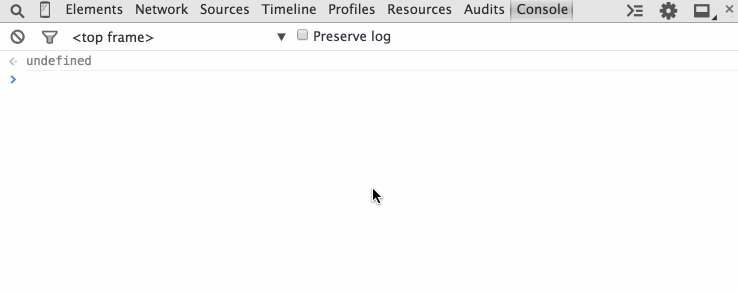

# Getting started with Optimizely's JS API

Follow the steps below to get started using Optimizely's JavaScript API. If you're already an Optimizely customer and have active experiments running on your web site, jump straight to [4. Read from the Optimizely Data Object](#read).

### 1. Create an Optimizely account

If you don't have an Optimizely account already, just sign up for a [free developer account](https://www.optimizely.com/?modal=devsignup). This account will give you access to core Optimizely features and API access, but with limited traffic allocation. No credit card is required, but you can always upgrade your account to a paid plan later.

### 2. Implement the Optimizely Snippet

If you are not already running Optimizely, you'll need to add the Optimizely Snippet to the head section of your web page. See [Implementing the Optimizely Snippet](https://help.optimizely.com/hc/en-us/articles/200040095) for detailed instructions on how to add the Optimizely Snippet for your project. You may also want to see

### 3. Start an experiment

To see the Optimizely JavaScript API in action, you should have at least one experiment running on your web page. The article [Get Started on Web Optimization](https://help.optimizely.com/hc/en-us/articles/200159574) contains detailed instructions on how to setup and run an experiment.

<a name="read"></a>
### 4. Read from the Data Object

The [Optimizely Data Object](/javascript/reference#the-data-object) is a read-only data object that contains information about the current visitor. You can use the Data Object to retrieve the state of and details about Optimizely experiments, variations, and goals for that visitor. For example, you can read which experiments and variations a visitor has seen and pass this information to your internal database.

To access the Data Object, open your browser console and type `window.optimizely.data`:



For example, you can see what experiments are active for the current visitor in the object below:

```javascript
window['optimizely'].data.state.activeExperiments
```

### 5. Make an API call

In addition to reading from the Data Object, you can also [make API calls](/javascript/reference#api-function-calls) to write data and modify the behavior of Optimizely. The API function calls expose many of Optimizely's decisions and actions so you can take control.

One example is starting experiments manually rather than upon page load, which is useful for testing dynamic web pages. Your application can tell Optimizely when to activate these "manual activation mode" experiments with the [activate](/javascript/reference#activate) API function. Another example is using the [bucketVisitor](/javascript/reference#bucket-visitor) API function to assign visitors to a specific variation if you wanted to incorporate inputs that Optimizely's traffic allocation algorithm does not. To see a full list of API calls you can make with the JavaScript API, see [API Function Calls](/javascript/reference#api-function-calls).

If you have any questions about using the JavaScript API, please reach out to <a href="mailto:developers@optimizely.com">developers@optimizely.com</a>.
