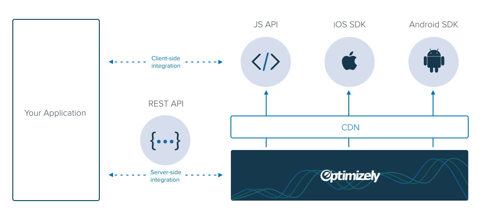

## Welcome!

*This site contains resources for developers who want to extend, integrate and build with Optimizely in new ways.*

### Getting started

If you are new to Optimizely, check out the [Use cases](#use-cases) below to understand the different ways to develop on our platform. For a more in-depth overview, you may also want to read [How Optimizely works](#how-optimizely-works) which explains Optimizely's data model, architecture, and the various integration points for developers.

If you're looking to develop on a specific platform, check out our documentation for the [REST API](/rest/introduction), [JS API](/javascript/introduction), [iOS SDK](/ios/introduction) and an [Android SDK](/android/introduction). Each API and SDK contains a brief getting started guide, comprehensive documentation, and FAQs. This site also includes a [Code samples](/javascript/code-samples) page with solutions from customers, partners, and Optimizely employees that you can download for free.

### Developer account

Optimizely offers a free account for developers that includes access to the APIs and SDKs. Creating an account takes 30 seconds and doesn't require a credit card.

<a class="button button--highlight anchor--middle display--block width--200 text--center" href="https://www.optimizely.com/?modal=devsignup">
Create a free account
</a>

### Developer support

If you have any questions or need help please email Optimizely's developer support team at [developers@optimizely.com](mailto:developers@optimizely.com). You can also post on our [developer discussion group](http://community.optimizely.com/t5/Developers/bd-p/Developers) on Optiverse. We're happy to help and eager to hear your feedback.

### Contributions

This site is open source and we welcome contributions from the non-Optimizely developer community. If you have any feedback or suggestions, please feel free to send us a pull request to the [developers.optimizely.com Github repo](http://github.com/optimizely/developers.optimizely.com).

## Use cases

Below are some common use cases of Optimizely for developers, and pointers to the relevant resources to get started.

### Custom implementations

Many Optimizely customers want to run more advanced tests and personalized experiences that are not possible in Optimizely's out-of-the-box solution. Below are some common customizations that we've seen from our customers.

* *Event tracking:* To track events that are not provided out of the box by Optimizely (e.g. purchase data or offline conversions), check out our section on [Events](/javascript/code-samples/#advanced-goal-tracking) which explains all of our available tracking APIs.

* *Variation code:* If you would like to write your own variation code instead of using the Optimizely visual editor, check out our [Variation code](/javascript/code-samples/#variation-code) section that explains how to format Optimizely variations with example code.

* *Audiences:* If you have data about the visitors to a site, you can use our platform to group those visitors into [Optimizely Audiences](/rest/reference#audiences). This makes it easy to target content to different audiences and segment experiment results.

* *Advanced use cases:* These advanced use cases ([Web](/javascript/code-samples/#advanced-use-cases) | [iOS](/ios/guide/index.html#advanced-setup) | [Android](/android/guide/index.html#advanced-setup)) will help you push the limits of what Optimizely is capable of doing within Project, Experiment, and Variation code.

* *Experiment results:* Utilize these code samples to better understand Optimizely's [/results endpoint](/rest/code-samples#stats). This endpoint provides high-level insights from Optimizely's Stats Engine.

* *Integrations:* Whether you're looking to create a custom integration with an analytics platform or if you're looking to do WordPress headline testing with Optimizely, you can refer to the following links for each of Optimizely's different channels will help you navigate these processes:
   * [Web integration guide](/integrations/)
   * [iOS integration guide](/ios/reference/index.html#-a-name-analytics-a-analytics-integrations)
   * [Android integration guide](/android/reference/index.html#-a-name-analytics-a-analytics-integrations)

* *Single page web apps (web only):* On traditional websites, when visitors click links, the links generally lead to a new URL and load an entirely new page. In Single Page Applications, the whole page doesn't reload; instead, certain content is changed, loaded, and swapped out in the current URL. Check out our [single page app](/javascript/code-samples/#single-page-apps) section to help accommodate the behavior of Single Page Applications.

* *Custom JS conditions (web only):* If you expose first or third party data on the client, then you can use Optimizely's [custom JS conditions](/javascript/code-samples/#custom-js) to port data into different audiences.

* *Conditional activation (web only):* Sometimes you'll want to trigger an Optimizely experiment dynamically, after some part of the page or screen has loaded. Read our [Conditional activation](/javascript/code-samples/#conditional) section for more information on how to control when Optimizely activates.

* *Helper functions (web only):* Many times, it is necessary to use getter and setter methods within Optimizely to better interact with your website. This list of [helper functions](/javascript/code-samples/#helpers) are frequently used in Project, Experiment, and Variation JavaScript.

### Integrations

Optimizely integrates with more than [30 Technology Partners](http://optimizely.com/partners/technology) to make it easy to exchange data between Optimizely and other tools. In addition, our customers often build custom integrations with 3rd parties or their own internal tools. If you are a partner or customer looking to build an integration, please refer to our [Integration Guide](/integrations) which includes detailed instructions for building many types of integrations with Optimizely.

### Mobile testing

Optimizely includes an [A/B testing solution](http://optimizely.com/mobile) for native iOS and Android apps. If you are looking at implementing Optimizely in your app for the first time, check out our [iOS getting started guide](/ios/guide) and [Android getting started guide](/android/guide), which contain detailed instructions for installing the Optimizely SDK and running your first experiment.

## How Optimizely works

This section explains the inner workings of Optimizely, including key terminology, architecture, and the available touchpoints for developers. [Life of an experiment](#life-of-an-experiment) describes a typical customer workflow and [Life of a visitor](#life-of-a-visitor) describes what happens when a visitor comes to a website or mobile app running Optimizely.

### Architecture

The diagram below provides an overview of the REST API, JS API, iOS SDK, and Android SDK. Your application can integrate with Optimizely in two ways:

* *Server-side:* Use the REST API to customize your optimization workflow.
* *Client-side:* Use the JS API, iOS SDK, or Android SDK to customize the behavior of Optimizely in a web page or app.

### Life of an experiment

Below is a typical workflow for a customer running an experiment with Optimizely.

#### *1. Create an experiment*

An *experiment* is a campaign run by Optimizely on either a website or a mobile app to determine the impact of a change.

Typically, an experiment is an *A/B test* that includes a control and one or more variations with changes to test. On the web we also support *multivariate tests* and *multi-page tests* ([learn more](https://help.optimizely.com/hc/en-us/articles/200039785)). Customers can configure what fraction of visitor traffic they'd like to allocate to their experiment.

* Learn how to [see which experiments are active on a web page](../javascript/reference#experiments)
* Learn how to [create an experiment using the REST API](../rest/reference#experiments)

#### *2. Create one or more variations*

In any given experiment, customers can create one or more *variations*, that contain alternative changes they'd like to test.

Technically speaking, a variation is just a snippet of code that can be executed in a user's browser or app to render the experience differently. On the web, a variation consists of a snippet of jQuery code. Variations can be created using Optimizely's [visual editor](https://help.optimizely.com/hc/en-us/articles/200039725) or using the [code editor](https://help.optimizely.com/hc/en-us/articles/200039835).

* Learn how to [edit jQuery code in the Optimizely editor](https://help.optimizely.com/hc/en-us/articles/200039835)
* Learn how to [register Live Variables](../ios/reference#-a-name-variables-a-register-live-variables) and [write Code Blocks](../ios/reference#-a-name-codeblocks-a-code-blocks) using the iOS SDK
* Learn how to [register Live Variables](../android/reference#-a-name-variables-a-register-live-variables) and [write Code Blocks](../android/reference#-a-name-codeblocks-a-code-blocks) using the Android SDK
* Learn how to [create a variation using the REST API](../rest/reference#variations)

#### *3. Create a target audience*

Customers can filter what type of traffic they'd like to include in an experiment using an *audience*.

On the web, an audience is just a set of AND/OR conditions about a user (e.g. browser type, geography, query parameters) that can be evaluated in real-time when a user visits a web page. Audiences can be saved and re-used for other experiments. You can use *custom dimensions* to manually define conditions by which visitors are assigned to an audience in a web browser, or use *uploaded lists* if you want to target a particular set of user identifiers (e.g. cookies or query parameters).

*Note:* We do not yet support audiences on iOS and Android, but you can still create your own [custom targeting conditions](https://help.optimizely.com/hc/en-us/articles/202296994#targeting) for an experiment.

* Learn how to [set custom dimensions for a visitor on a web page](../javascript/reference#dimensions)
* Learn how to [manually assign a visitor to an audience on a web page](../javascript/reference#audiences)
* Learn how to [create custom targeting conditions in an iOS app](../ios/reference#-a-name-targeting-a-custom-targeting)
* Learn how to [create custom targeting conditions in an Android app](../ios/reference#-a-name-targeting-a-custom-targeting)
* Learn how to [create a custom dimension using the REST API](../rest/reference#dimensions)
* Learn how to [create an audience using the REST API](../rest/reference#audience)
* Learn how to [use uploaded lists in Optimizely using the REST API](../rest/reference#user_lists)

#### *4. Create a goal*

Customers must define at least one *goal* for their experiment, i.e. a metric to measure the impact of the experiment.

Experiments can have an arbitrary number of goals but just one *primary goal*. Optimizely customers can define click goals or pageview goals using the goal creation dialog, or they can create *custom events* that are goals defined through code. Any goals that are defined for an experiment are tracked in the Optimizely backend over the lifetime of the experiment.

* Learn how to [track custom events from a web browser](../javascript/reference#track-event)
* Learn how to [track custom events from an iOS app](../ios/reference#-a-name-goaltracking-a-goal-tracking)
* Learn how to [track custom events from an Android app](../android/reference#-a-name-goaltracking-a-goal-tracking)
* Learn how to [create a goal using the REST API](../rest/reference#goals)

#### *5. Start the experiment*

Once the experiment has been configured, the customer can start the experiment using the *Start experiment* button.

On taking this action, Optimizely updates the *snippet* or *datafile* sent over the CDN with instructions to run the experiment in the website or mobile app.

* Learn how to [start an experiment using the REST API](../rest/reference#experiments)

#### *6. Monitor the results*

A customer can now see the results of their experiment in real-time by looking at the Optimizely results page.

The results page contains how many visitors were assigned to each variation and the number of *conversions* over time, for each of the experiment goals that have been defined. Customers can also apply *segmentation* to the results page based on dimensions and audiences that they have defined.

* Learn how to [get the results of an experiment using the REST API](../rest/reference#stats)

#### *7. Deploy winners*

Customers can deploy winners by allocating 100% of their visitor traffic to the winning variation.

* Learn how to [change traffic allocation using the REST API](../rest/reference#experiments)

### Life of a visitor

Check out the following articles for a detailed overview of Optimizely's execution on web sites and mobile apps:

* [How Optimizely Works: Snippet order of execution, JavaScript evaluation timing, and cookies](https://help.optimizely.com/hc/en-us/articles/200040335)
* [How Optimizely's SDKs Work: SDK Order of execution, experiment activation, and goals](https://help.optimizely.com/hc/en-us/articles/205014107)

The execution of Optimizely can be summarized in the steps below.

#### *1. Evaluate targeting conditions*

The first thing Optimizely does is it collects information about the visitor, to determine what audiences that visitor is a part of.

* Learn how to [write custom targeting criteria in JavaScript](/samples#custom-js)
* Learn how to [manually assign a visitor to an audience on a web page](../javascript/reference#audiences)
* Learn how to [create custom targeting conditions in an iOS app](../ios/reference#-a-name-targeting-a-custom-targeting)
* Learn how to [create custom targeting conditions in an Android app](../ios/reference#-a-name-targeting-a-custom-targeting)

#### *2. Assign experiments*

Next, Optimizely determines what experiment(s) (if any) should be shown to the user. This decision is based on what audiences the visitor is in, random traffic allocation, and any additional experiment targeting criteria.

#### *3. Assign variation*

If the visitor has been bucketed into an experiment, Optimizely decides which variation should be shown to the visitor using random assignment, according to the relative traffic allocation specified by the customer.

* Learn how to [assign a visitor to a specific variation on a web page](/rest/reference#bucket-visitor)
* Learn how to [send variation data to an analytics tool](/samples#technology-integrations-analytics)

#### *4. Activate experiment*

Optimizely runs the code for the chosen variation. By default, this is done before the page loads on a website to ensure that the visitor doesn't see flicker. However, many customers may want to activate an experiment after a page has loaded. For more information see conditional activation.

* Learn how to [conditionally activate experiments using JavaScript](/samples#conditional)
* Learn how to [manually activate experiments using JavaScript](/javascript/reference#activate)

#### *5. Track events*

Once the page or mobile app has been rendered to the user, Optimizely tracks events by sending information to the Optimizely backend.

* Learn how to [track custom events from a web browser](../javascript/reference#track-event)
* Learn how to [track custom events from an iOS app](../ios/reference#-a-name-goaltracking-a-goal-tracking)
* Learn how to [track custom events from an Android app](../android/reference#-a-name-goaltracking-a-goal-tracking)
