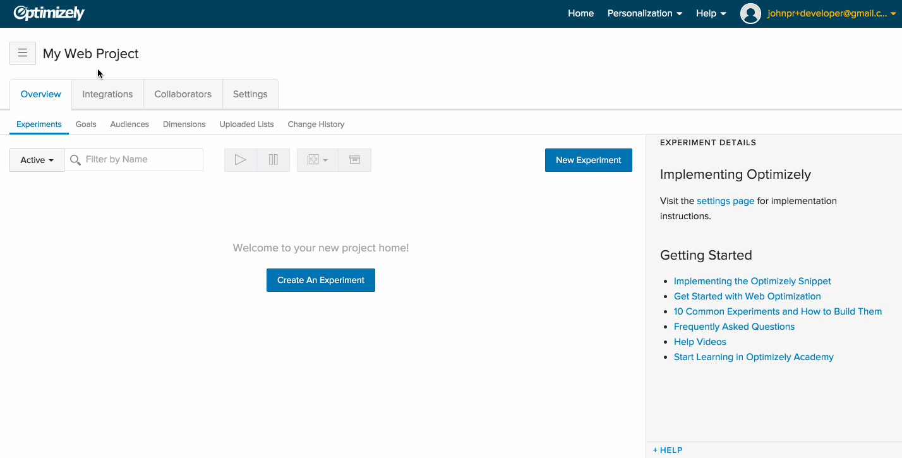
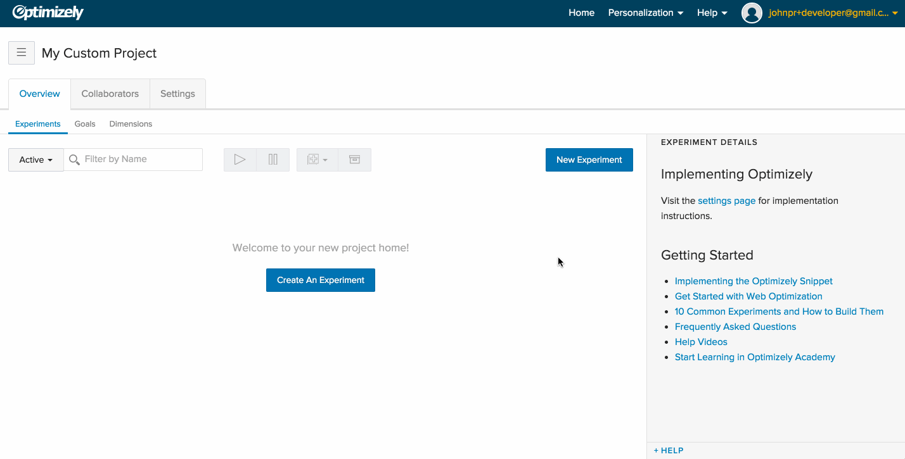
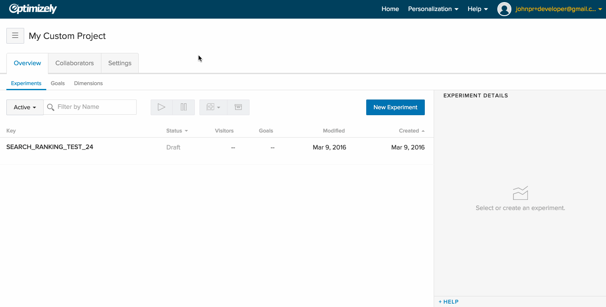
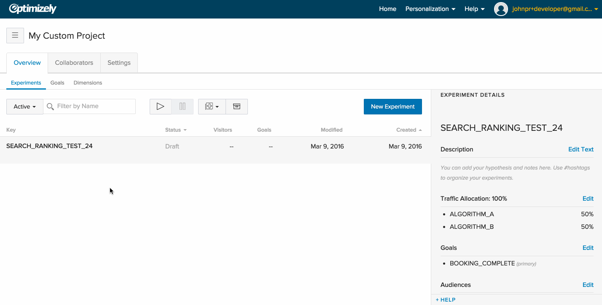

<h1 id="getting-started-with-server-side-testing" class="flush--bottom">Getting started with Server-Side Testing</h1>

  <ul class="nav unstyled float--right">
    <li class="z-index--2"><a class="muted weight--bold color--brand" href="#" data-toggle-trigger="python-code"
    data-toggle-trigger-prop="lang" data-toggle-trigger-class="color--brand">Python</a></li>
    <li class="z-index--2"><a class="muted weight--bold" href="#" data-toggle-trigger="java-code"
    data-toggle-trigger-prop="lang" data-toggle-trigger-class="color--brand">Java</a></li>
    <li class="z-index--2"><a class="muted weight--bold" href="#" data-toggle-trigger="ruby-code"
    data-toggle-trigger-prop="lang" data-toggle-trigger-class="color--brand">Ruby</a></li>
    <li class="z-index--2"><a class="muted weight--bold" href="#" data-toggle-trigger="node-code"
    data-toggle-trigger-prop="lang" data-toggle-trigger-class="color--brand">Node</a></li>
  </ul>

Create your first server-side test in 5 minutes!

### 1. Create an Optimizely account

If you don't have an Optimizely account already, just sign up for a [free developer account](https://www.optimizely.com/?modal=devsignup). This account will give you access to core Optimizely features and API access, but with limited traffic allocation. No credit card is required, but you can always upgrade your account to a paid plan later.

### 2. Add a Custom Project

Custom projects are not yet generally available to Optimizely customers. Please contact [developers@optimizely.com](mailto:developers@optimizely.com) if you are interested in getting early access or giving us feedback.

To set up a server-side experiment, you'll first need to create a *Custom Project*. Custom Projects are different than Web, iOS, and Android projects because they allow you to run custom experiments in any platform. For more information see [adding projects](https://help.optimizely.com/hc/en-us/articles/203659720#add).

### 3. Create an experiment

You can create a server-side experiment in a custom project by clicking on *New Experiment*. All you need to create an experiment is an *Experiment Key* (i.e. a unique identifier for your experiment to be referenced in code) and one or more *Variation Keys* (i.e. identifiers for the variations you'd like test in your code). Optionally, you can also specify what traffic allocation you'd like to send to the experiment and variations. In the example below, we're create an experiment with the following parameters:

* *Experiment Key:* `SEARCH_RANKING_TEST_24`
* *Variation Key 1:* `ALGORITHM_A`
* *Variation Key 2:* `ALGORITHM_B`
* *Experiment Allocation:* 5% of traffic is included in the experiment
* *Variation Allocation:* 50/50

### 4. Create goals for the experiment

You'll need to create at least one goal for your experiment, e.g. a conversion event. To do so, go to the *Goals* tab and click on *New Goal*. Like experiments and variations, you'll need to specify a *Goal Key* that can be used to track that goal in your code. In this example, we've used `BOOKING_COMPLETE` as the goal and added it to the `SEARCH_RANKING_TEST_24` experiment.

### 5. Add the experiment to your code

Our server-side SDKs are not yet generally available to Optimizely customers. Please contact [developers@optimizely.com](mailto:developers@optimizely.com) if you are interested in getting early access or giving us feedback.

You're now ready to set up your experiment in your code. We've provided several SDKs you can use to split traffic in your code and send conversion events back to Optimizely. For more information on how to set up the experiment in your code, please see the [Reference](../reference) section that goes over how to download and use our SDKs in detail. As an alternative to using one of the Optimizely SDKs, you're also free to use our APIs directly.

### 6. Start the experiment!

Once you've deployed your code and it's receiving live traffic, you're ready to start the experiment! To do that you just need to press the start button from Optimizely. You can now monitor the results by clicking on the *Results* button and see the results in real-time.

If you have any questions, please reach out to [developers@optimizely.com](mailto:developers@optimizely.com). Our developer support team is happy to help support you running your first server-side experiment!
