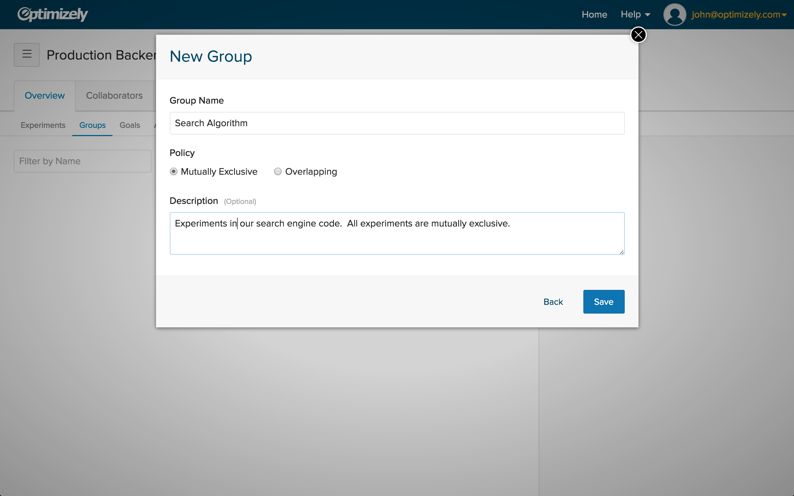
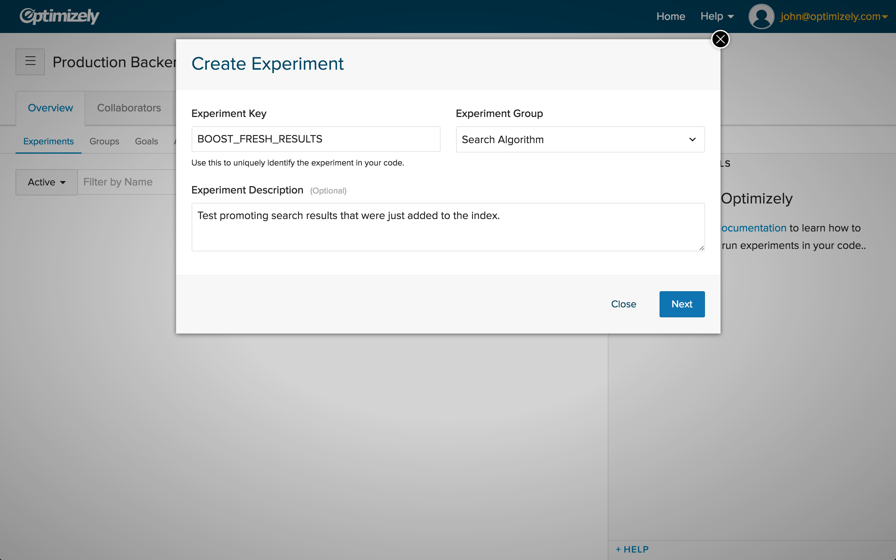

# Experiment Groups

<h4>
In Custom Projects, you can create groups of experiments. You can create two different types of groups: **overlapping** and **mutually exclusive**. 

To get started, head over to the **Groups** tab and select **New Group**. When you create experiments ensure you have placed them in the correct group. 
</h4>

### Overlapping group

An overlapping group allows experiments to be brought together for organization or categorization. For example, you can create separate groups for your homepage tests, search result tests, and pricing tests. This allows for teams to track types of experiments they are running with Optimizely. A user can be in multiple experiments within the same overlapping group. User bucketing is done at the experiment level, similar to non-grouped experiments.

### Mutually Exclusive

Developers should leverage mutually exclusive groups to bring experiments together to eliminate the interaction effects between experiments. You should create mutually exclusive experiments to ensure that certain groups of experiments never collide for the same user.  A user can be in at most one experiment per mutually exclusive group. User bucketing is first performed at the group level, where the user is bucketed into an experiment and will not be introduced to new experiments.

Create a group:

Add an experiment to the group:

